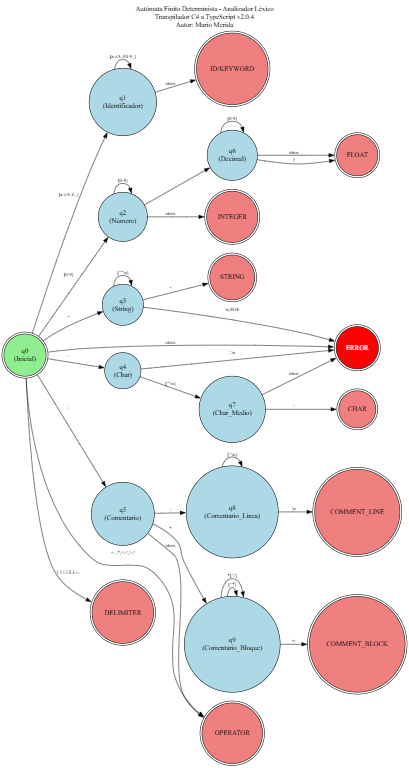
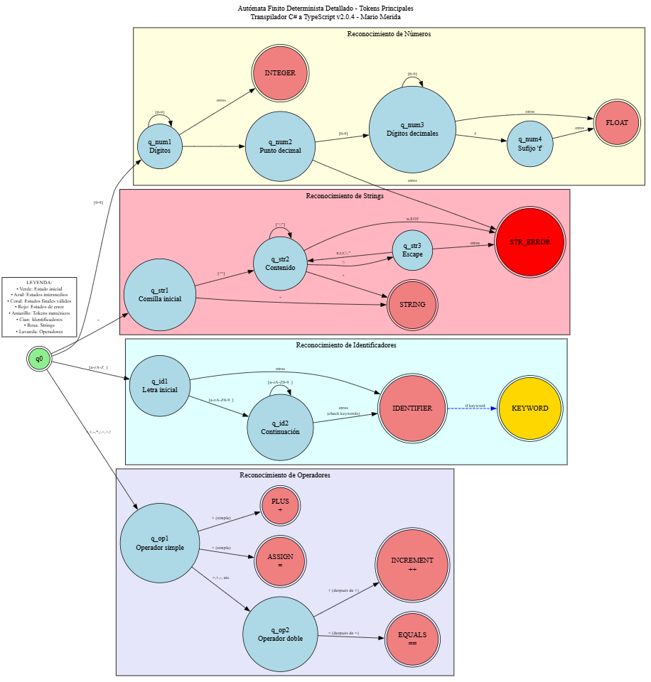

# Manual Técnico - Transpilador C# a TypeScript

**Autor:** Mario Merida  
**Versión:** 2.0.4

## Arquitectura del Sistema

### Estructura en Capas
1. **Presentación**: Frontend (HTML/CSS/JS)
2. **API**: Express.js + TypeScript
3. **Lógica**: Analizadores Léxico y Sintáctico
4. **Modelos**: Tipos y estructuras de datos

## Analizador Léxico

### Autómata Finito Determinista
Implementado como AFD que procesa caracteres individualmente:



### Tokens Reconocidos
- **Palabras reservadas**: `using`, `public`, `class`, `static`, `void`, `Main`
- **Tipos**: `int`, `float`, `string`, `char`, `bool`
- **Literales**: números, strings, chars, booleans
- **Operadores**: aritméticos, relacionales, asignación
- **Delimitadores**: `()`, `{}`, `[]`, `;`, `,`, `.`
- **Comentarios**: `//` y `/* */`



### Algoritmo Principal
```typescript
class LexicalAnalyzer {
    analyze(): LexicalResult {
        while (position < input.length) {
            skipWhitespace();
            
            if (isLetter(char)) {
                token = scanIdentifier();
            } else if (isDigit(char)) {
                token = scanNumber();
            } else if (char === '"') {
                token = scanString();
            }
            // ... más casos
            
            if (token) tokens.push(token);
        }
        return { tokens, errors };
    }
}
```

## Analizador Sintáctico

### Análisis Descendente Recursivo
Basado en gramática BNF con funciones recursivas para cada regla:

```bnf
<program> ::= <block_using> <class>
<class> ::= 'public' 'class' ID '{' <block_Main> '}'
<block_Main> ::= 'static' 'void' 'Main' '(' 'string' '[' ']' ID ')' '{' <lista_instrucciones> '}'
<instruction> ::= <declaracion> | <asignacion> | <imprimir> | <inst_if> | <inst_for>
<expresion> ::= <aritmetica> <relacional>
<aritmetica> ::= <termino> <aritmeticaP>
<termino> ::= <factor> <terminoP>
<factor> ::= '(' <aritmetica> ')' | id | num | string | char | bool
```

### Precedencia de Operadores
| Nivel | Operadores | Asociatividad |
|-------|------------|---------------|
| 4 | `()` | Izquierda |
| 3 | `*`, `/` | Izquierda |
| 2 | `+`, `-` | Izquierda |
| 1 | `==`, `!=`, `<`, `>`, `<=`, `>=` | Izquierda |

### Algoritmo de Parsing
```typescript
class SyntaxAnalyzer {
    parseExpresion(): string {
        const left = parseAritmetica();
        const operator = parseRelacional();
        
        if (operator) {
            const right = parseAritmetica();
            return `${left} ${operator} ${right}`;
        }
        return left;
    }
    
    parseAritmetica(): string {
        let result = parseTermino();
        while (isAddOp(currentToken)) {
            const op = currentToken.lexeme;
            advance();
            result = `${result} ${op} ${parseTermino()}`;
        }
        return result;
    }
}
```

## Tabla de Símbolos

### Estructura
```typescript
class Symbol {
    constructor(
        public name: string,      // Nombre variable
        public value: string,     // Valor actual
        public type: string,      // Tipo de dato
        public line: number,      // Línea declaración
        public column: number     // Columna declaración
    ) {}
}
```

### Operaciones
- **Insert**: Agregar nueva variable
- **Update**: Modificar valor existente
- **Find**: Buscar por nombre
- **List**: Obtener todas las variables

## Traducción C# → TypeScript

### Mapeo de Tipos
```typescript
private csharpToTypeScript(type: string): string {
    const typeMap = {
        'int': 'number',
        'float': 'number', 
        'string': 'string',
        'char': 'string',
        'bool': 'boolean'
    };
    return typeMap[type] || 'any';
}
```

### Mapeo de Estructuras
| C# | TypeScript |
|----|------------|
| `Console.WriteLine()` | `console.log()` |
| `int x = 5;` | `let x: number = 5;` |
| `for (int i = 0; i < n; i++)` | `for (let i: number = 0; i < n; i++)` |

## API REST

### Endpoints Principales
```typescript
POST /api/analyze        // Análisis completo
POST /api/lexical        // Solo análisis léxico  
POST /api/syntax         // Solo análisis sintáctico
GET  /api/health         // Estado del servicio
```

### Estructura de Respuesta
```typescript
interface AnalyzeResponse {
    success: boolean;
    lexical: {
        tokens: Token[];
        errors: LexicalError[];
    };
    syntax: {
        symbols: Symbol[];
        errors: SyntaxError[];
        consoleOutput: string[];
        translatedCode: string;
    };
    summary: {
        totalTokens: number;
        lexicalErrors: number;
        syntaxErrors: number;
        hasErrors: boolean;
    };
}
```

## 🔧 Manejo de Errores

### Tipos de Errores
1. **Léxicos**: Caracteres no reconocidos, strings no terminadas
2. **Sintácticos**: Estructura gramatical incorrecta, tokens faltantes

### Estrategias de Recuperación
```typescript
class ErrorRecovery {
    // Modo pánico: omitir hasta punto de sincronización
    panicMode(): void {
        while (currentToken && !isSyncPoint(currentToken)) {
            advance();
        }
    }
    
    // Puntos de sincronización: ;, }, IF, FOR, CONSOLE
    private isSyncPoint(token: Token): boolean {
        return [';', '}', 'IF', 'FOR', 'CONSOLE'].includes(token.type);
    }
}
```

## Complejidad Algorítmica

| Componente | Temporal | Espacial |
|------------|----------|----------|
| Analizador Léxico | O(n) | O(t) |
| Analizador Sintáctico | O(n) | O(d) |
| Tabla de Símbolos | O(s) | O(s) |

*Donde n=caracteres, t=tokens, d=profundidad, s=símbolos*

## Estructura del Código

### Organización de Archivos
```
src/
├── models/index.ts           # Tipos y clases base
├── lexer/LexicalAnalyzer.ts  # Analizador léxico  
├── parser/SyntaxAnalyzer.ts  # Analizador sintáctico
├── controllers/              # Controladores API
├── routes/                   # Rutas Express
└── server.ts                 # Servidor principal
```

### Flujo de Procesamiento
```
Código C# → Analizador Léxico → Tokens → Analizador Sintáctico → 
AST + Tabla Símbolos + Código TypeScript + Errores
```

## Testing

### Casos de Prueba
- **Unitarios**: Cada función de análisis
- **Integración**: Flujo completo 
- **Aceptación**: Programas C# completos

### Archivos de Prueba
- `test_errors.cs`: Errores básicos y sintácticos
- `test_subtle_errors.cs`: Errores semánticos
- `test_lexical_errors.cs`: Caracteres especiales

## Validaciones de Seguridad

- **Tamaño máximo** de código de entrada
- **Caracteres permitidos** (ASCII válido)
- **Límites de recursión** en parsing
- **Timeout** para análisis largos
- **Sanitización** de strings de entrada

---

*Manual Técnico - Transpilador C# a TypeScript v2.0.4 - Mario Merida*